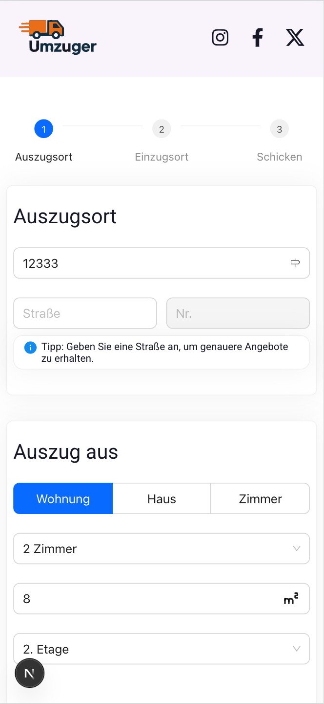
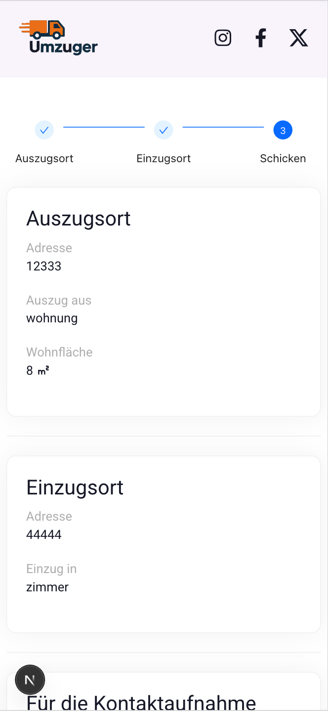

# 🚚 Umzuger – Transport Assistant

A lightweight and user-friendly open-source To help people when they move to a new home

### Why

- Transport companies get in touch with clients fastly
- Clients can get in touch and make a request with few touches

   

<br>
<div align='center' style="border:1px solid #ddd; border-radius:12px; padding: 12px; margin-bottom:12px">
  
  
</div>
<p align='center'>
  
    
</p>
<br>

## 🚀 Getting Started

```
git clone https://github.com/zaqoutm/umzuger.git
cd umzuger
npm install
npm run dev
```

## 🛠️ Tech stack

- Next js
- ant-design
- react-hook-form
- react-icons
- resend

---

📄 License MIT License © 2025
<br>
📬 Contact Email: mo.zaqout@gmail.com
